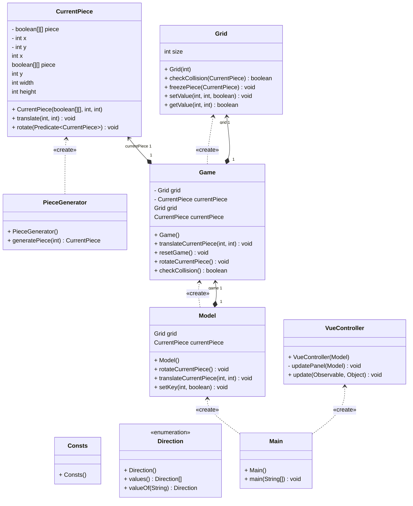

```mermaid
classDiagram
direction BT
class Consts {
  + Consts() 
}
class CurrentPiece {
  + CurrentPiece(boolean[][], int, int) 
  - boolean[][] piece
  - int x
  - int y
  + translate(int, int) void
  + rotate(Predicate~CurrentPiece~) void
   int x
   boolean[][] piece
   int y
   int width
   int height
}
class Direction {
<<enumeration>>
  + Direction() 
  + values() Direction[]
  + valueOf(String) Direction
}
class Game {
  + Game() 
  - Grid grid
  - CurrentPiece currentPiece
  + translateCurrentPiece(int, int) void
  + resetGame() void
  + rotateCurrentPiece() void
  + checkCollision() boolean
   Grid grid
   CurrentPiece currentPiece
}
class Grid {
  + Grid(int) 
  + checkCollision(CurrentPiece) boolean
  + freezePiece(CurrentPiece) void
  + setValue(int, int, boolean) void
  + getValue(int, int) boolean
   int size
}
class Main {
  + Main() 
  + main(String[]) void
}
class Model {
  + Model() 
  + rotateCurrentPiece() void
  + translateCurrentPiece(int, int) void
  + setKey(int, boolean) void
   Grid grid
   CurrentPiece currentPiece
}
class PieceGenerator {
  + PieceGenerator() 
  + generatePiece(int) CurrentPiece
}
class VueController {
  + VueController(Model) 
  - updatePanel(Model) void
  + update(Observable, Object) void
}

Game "1" *--> "currentPiece 1" CurrentPiece 
Game "1" *--> "grid 1" Grid 
Game  ..>  Grid : «create»
Main  ..>  Model : «create»
Main  ..>  VueController : «create»
Model "1" *--> "game 1" Game 
Model  ..>  Game : «create»
PieceGenerator  ..>  CurrentPiece : «create»
```