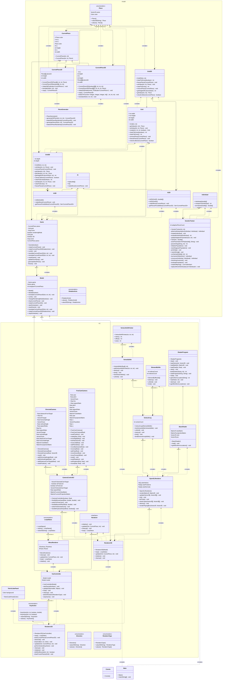

```mermaid
---
config:
  layout: elk
---
classDiagram
    direction BT
    namespace VC {
        class BaseShader {
            Matrix4f viewMatrix
            Matrix4f projectionMatrix
            Vector3f color
            Vector3f pos
            + BaseShader()
            + load() void
            # getAllUniformLocations() void
        }
        class VertexArray {
            int vertexCount
            + VertexArray(ElementBuffer)
            + bindVertexBuffer(VertexBuffer) void
            + unbind() void
            + destroy() void
            + bind() void
            - bindElementArrayBuffer() void
        }
        class DirectedCamera {
            - float distanceFromTarget
            + float fov
            - Vector3f target
            - float horizontalAngle
            - Vector3f pos
            - float verticalAngle
            - float aspectRatio
            float fov
            float aspectRatio
            Vector3f target
            float verticalAngle
            Vector3f pos
            float distanceFromTarget
            float horizontalAngle
            Matrix4f viewMatrix
            Matrix4f projectionMatrix
            + DirectedCamera()
            + DirectedCamera(float)
            + DirectedCamera(float, Vector3f)
            + reset() void
            + addHorizontalAngle(float) void
            + addVerticalAngle(float) void
            + addDistanceFromTarget(float) void
            + resetPosition() void
        }
        class VertexBuffer {
            + VertexBuffer(float[], int)
            + addVertexAttribPointer(int, int, int) void
            + destroy() void
            + bind() void
            + bindVertexAttribs() void
            + unbind() void
        }
        class ShaderProgram {
            + ShaderProgram()
            + stop() void
            + loadVector(int, Vector3f) void
            + loadMat4(int, Matrix4f) void
            + loadFloat(int, float) void
            + start() void
            - loadShader(String, int) int
            + loadProgram(String, String) void
            + load() void
            # getUniformLocation(String) int
            + loadInt(int, int) void
            + destroy() void
            # getAllUniformLocations() void
        }
        class FreeCamCamera {
            - float yaw
            - float pitch
            - Vector3f pos
            + float fov
            + float aspectRatio
            float pitch
            float fov
            float aspectRatio
            Vector3f pos
            Matrix4f viewMatrix
            float yaw
            Matrix4f projectionMatrix
            float z
            Vector3f position
            float x
            float y
            + FreeCamCamera()
            + FreeCamCamera(float)
            + resetPosition() void
            + rotate(float, float) void
            + moveRight(float) void
            + lookAt(Vector3f) void
            + moveLeft(float) void
            + addPitch(float) void
            + moveBackwards(float) void
            + moveUp(float) void
            + addYaw(float) void
            + moveDown(float) void
            + moveForward(float) void
            + reset() void
            + resetRotation() void
            + setRotation(float, float) void
            + move(float, float) void
        }
        class CameraController {
            - Vector3f directedCamTarget
            - boolean isFreeCam
            boolean isFreeCam
            Vector3f directedCamTarget
            float aspectRatio
            Matrix4f currentViewMatrix
            Matrix4f currentProjectionMatrix
            + CameraController(boolean, float)
            + handleMouseInput(float, double, double) void
            + switchToFreeCam() void
            + handleMouseWheel(float, double) void
            + switchToDirectedCam() void
            + handleKeyboardInput(float, boolean[]) void
        }
        class OpenGLRenderer {
            int[] cubeIndices
            float[] cubePositions
            float[] cubeNormals
            + OpenGLRenderer()
            + render(Matrix4f, Matrix4f) void
            + update(Vector3f[], Vector3f[]) void
            + init() void
            - initCube() void
            + drawCubes(Vector3f[], Vector3f[]) void
            + destroy() void
            + renderPlayingBox(Vector3f, Vector3f) void
        }
        class Renderer3D {
            + Renderer3D(Model)
            + loop() LoopStatus
            + update(Grid, CurrentPiece, int) void
            + initialize() void
            + cleanup() void
        }
        class Direction {
            + Direction()
            + valueOf(String) Direction
            + values() Direction[]
        }
        class RendererType {
            + RendererType()
            + valueOf(String) RendererType
            + values() RendererType[]
        }
        class VueController {
            - Model model
            Model model
            + VueController(Model)
            ~ startGame(boolean) void
            + update(Observable, Object) void
            + loop() void
            + cleanup() void
            - switchRenderer(RendererType) void
            ~ stopGame() void
        }
        class Renderer2D {
            + Renderer2D(VueController)
            + loop() LoopStatus
            - drawCurrentPiece(CurrentPiece2D) void
            - clearGrid() void
            - drawCell(int, int, Color) void
            + update(Grid, CurrentPiece, int) void
            - performAction(KeyAction) void
            + cleanup() void
            + initialize() void
            - isWithinBounds(int, int) boolean
            - drawFrozenPieces(Grid) void
        }
        class MenuRenderer {
            JTextArea JTextArea
            JPanel JPanel
            + MenuRenderer()
            + cleanup() void
            + update(Grid, CurrentPiece, int) void
            + loop() LoopStatus
            + initialize() void
        }
        class TetrisCubePanel {
            Color background
            ~ TetrisCubePanel(Color)
        }
        class VertexAttribPointer {
            + VertexAttribPointer(int, int, int)
            + index() int
            + offset() int
            + size() int
        }
        class ElementBuffer {
            - int indicesCount
            int indicesCount
            + ElementBuffer(int[])
            + destroy() void
            + unbind() void
            + bind() void
        }
        class Renderer {
            + initialize() void
            + update(Grid, CurrentPiece, int) void
            + cleanup() void
            + loop() LoopStatus
        }
        class KeyAction {
            - KeyAction(int, int, boolean, double)
            - KeyAction(int, int, boolean)
            + valueOf(String) KeyAction
            + values() KeyAction[]
        }
        class LoopStatus {
            + LoopStatus()
            + values() LoopStatus[]
            + valueOf(String) LoopStatus
        }
    }
    namespace model {
        class Ai3D {
            + Ai3D(Grid3D)
            + makeMove(CurrentPiece) void
            - getPiecesPossibilities(CurrentPiece3D) Set~CurrentPiece3D~
        }
        class Ai2D {
            + Ai2D(Grid2D, double[])
            + Ai2D(Grid2D)
            + makeMove(CurrentPiece) void
            - getPiecesPossibilities(CurrentPiece2D) Set~CurrentPiece2D~
        }
        class Individual {
            + Individual(double[])
            + compareTo(Individual) int
            - normalize(double[]) double[]
        }
        class Ai {
            + Ai(double[])
            + Ai()
            + makeMove(CurrentPiece) void
        }
        class GeneticTrainer {
            int adaptivePieceCount
            + GeneticTrainer(int, int)
            - sphericalInterpolation(Individual, Individual) Individual
            - mutate(Individual) void
            - evaluateIndividual(Individual) int
            - updateAdaptiveParameters(int, int) void
            + train(int) double[]
            - saveParametersToFile(double[], String) void
            - parseIntArg(String, int) int
            - initializePopulation() void
            - resetStagnantPopulation() void
            - printHelp() void
            + main(String[]) void
            - runGame(double[], int) int
            - tournamentSelection() Individual
            - crossover(Individual, Individual) Individual
            - checkImprovement() void
            - evaluatePopulation() void
            - createOffspring() List~Individual~
            - replaceWorstIndividuals(List~Individual~) void
        }
        class Model {
            - Game game
            Game game
            int droppedYCurrentPiece
            + Model()
            + Model(boolean)
            + translateCurrentPiece3D(int, int, int) void
            + runAi() void
            + changeRenderingMode(boolean) void
            + dropCurrentPiece() void
            + rotateCurrentPiece2D() void
            + startScheduler() void
            + resetGame() void
            + translateCurrentPiece2D(int, int) void
            + rotateCurrentPiece3D(RotationAxis) void
            + stopScheduler() void
        }
        class RotationAxis {
            + RotationAxis()
            + values() RotationAxis[]
            + valueOf(String) RotationAxis
        }
        class Game {
            - CurrentPiece piece
            - Grid grid
            - long score
            boolean renderingMode
            Grid grid
            boolean 3D
            long score
            CurrentPiece piece
            + Game(boolean)
            + rotateCurrentPiece() void
            + rotateCurrentPiece3D(RotationAxis) void
            + runAi() void
            + translateCurrentPiece2D(int, int) void
            + translateCurrentPiece3D(int, int, int) void
            + resetGame() void
            - updateScore(long) void
            - generateNewPiece() void
            - freeze() void
        }
        class Grid3D {
            - int depth
            int depth
            + Grid3D(int, int, int)
            + setValue(int, int, Piece) void
            + removePiece(CurrentPiece) void
            + getValue(int, int) Piece
            + getValue(int, int, int) Piece
            + getHeightOfColumn3D(int, int) int
            + checkCollision(CurrentPiece) boolean
            + clearFullLines(boolean) int
            + setValue(int, int, int, Piece) void
            + clearFullLines() int
            + freezePiece(CurrentPiece) void
        }
        class CurrentPiece3D {
            - int z
            int depth
            int z
            int height
            Piece[][][] piece3d
            int width
            + CurrentPiece3D(boolean[][][], int, int, int)
            + CurrentPiece3D(Piece[][][], int, int, int, Piece)
            + rotate3D(RotationAxis, Predicate~CurrentPiece~) void
            + copy() CurrentPiece3D
            - rotate(TriFunction~Integer, Integer, Integer, int[]~, int, int, int) void
            + translate3D(int, int, int) void
        }
        class CurrentPiece {
            # Piece color
            # int y
            # int x
            Piece color
            int y
            int height
            int x
            int width
            + CurrentPiece(int, int)
            + CurrentPiece(int, int, Piece)
        }
        class Grid {
            # int width
            # int height
            int height
            int width
            + Grid(int, int)
            + getValue(int, int) Piece
            + setValue(int, int, Piece) void
            + create(int, int, int, boolean) Grid
            + clearFullLines(boolean) int
            + clearFullLines() int
            + removePiece(CurrentPiece) void
            + freezePiece(CurrentPiece) void
            + checkCollision(CurrentPiece) boolean
        }
        class Grid2D {
            + Grid2D(int, int)
            + clearFullLines(boolean) int
            + freezePiece(CurrentPiece) void
            + setValue(int, int, Piece) void
            + clearFullLines() int
            + removePiece(CurrentPiece) void
            + getHeightOfColumn2D(int) int
            + getValue(int, int) Piece
            + checkCollision(CurrentPiece) boolean
        }
        class Piece {
            Vector3f vector
            Color color
            + Piece()
            + valueOf(String) Piece
            + values() Piece[]
        }
        class PieceGenerator {
            + PieceGenerator()
            + generate3DPiece(int, int, int) CurrentPiece3D
            - rotate3DPieceRandomly(CurrentPiece3D) void
            + generatePiece2D(int, int) CurrentPiece2D
            - rotate2DPieceRandomly(CurrentPiece2D) void
        }
        class CurrentPiece2D {
            Piece[][] piece2d
            int height
            int width
            + CurrentPiece2D(Piece[][], int, int, Piece)
            + CurrentPiece2D(boolean[][], int, int)
            + rotate2d(Predicate~CurrentPiece~) void
            + translate2d(int, int) void
            + copy() CurrentPiece2D
        }
    }
    class Consts {
        + Consts()
    }
    class Main {
        + Main()
        + main(String[]) void
    }

    <<enumeration>> Direction
    <<enumeration>> RendererType
    <<Interface>> Renderer
    <<enumeration>> KeyAction
    <<enumeration>> RotationAxis
    <<enumeration>> Piece
    <<enumeration>> LoopStatus

    Ai2D --> Ai
    Ai2D "1" *--> "grid 1" Grid2D
    Ai3D --> Ai
    Ai3D "1" *--> "grid 1" Grid3D
    BaseShader --> ShaderProgram
    CameraController "1" *--> "directedCamera 1" DirectedCamera
    CameraController ..> DirectedCamera : «create»
    CameraController ..> FreeCamCamera : «create»
    CameraController "1" *--> "freeCam 1" FreeCamCamera
    CurrentPiece "1" *--> "color 1" Piece
    CurrentPiece2D --> CurrentPiece
    CurrentPiece2D "1" *--> "pieceColor *" Piece
    CurrentPiece2D ..> Piece : «create»
    CurrentPiece3D --> CurrentPiece
    CurrentPiece3D "1" *--> "pieceColor *" Piece
    CurrentPiece3D ..> Piece : «create»
    Game "1" *--> "ai 1" Ai
    Game ..> Ai2D : «create»
    Game ..> Ai3D : «create»
    Game "1" *--> "piece 1" CurrentPiece
    Game "1" *--> "grid 1" Grid
    GeneticTrainer ..> Ai2D : «create»
    GeneticTrainer ..> Grid2D : «create»
    GeneticTrainer "1" *--> "population *" Individual
    GeneticTrainer ..> Individual : «create»
    Grid ..> Grid2D : «create»
    Grid ..> Grid3D : «create»
    Grid2D --> Grid
    Grid2D ..> Piece : «create»
    Grid2D "1" *--> "grid *" Piece
    Grid3D --> Grid
    Grid3D "1" *--> "grid *" Piece
    Grid3D ..> Piece : «create»
    GeneticTrainer --> Individual
    Renderer2D --> KeyAction
    Main ..> Model : «create»
    Main ..> VueController : «create»
    MenuRenderer "1" *--> "nextLoopStatus 1" LoopStatus
    MenuRenderer ..> Renderer
    Model ..> Game : «create»
    Model "1" *--> "game 1" Game
    OpenGLRenderer ..> BaseShader : «create»
    OpenGLRenderer "1" *--> "shader 1" BaseShader
    OpenGLRenderer ..> ElementBuffer : «create»
    OpenGLRenderer "1" *--> "cubeVao 1" VertexArray
    OpenGLRenderer ..> VertexArray : «create»
    OpenGLRenderer ..> VertexBuffer : «create»
    PieceGenerator ..> CurrentPiece2D : «create»
    PieceGenerator ..> CurrentPiece3D : «create»
    Renderer2D ..> Renderer
    Renderer2D ..> TetrisCubePanel : «create»
    Renderer2D "1" *--> "vueController 1" VueController
    Renderer3D ..> CameraController : «create»
    Renderer3D "1" *--> "camController 1" CameraController
    Renderer3D "1" *--> "model 1" Model
    Renderer3D ..> OpenGLRenderer : «create»
    Renderer3D "1" *--> "renderer 1" OpenGLRenderer
    Renderer3D ..> Renderer
    VertexArray "1" *--> "elementBuffer 1" ElementBuffer
    VertexArray "1" *--> "vertexBuffers *" VertexBuffer
    VertexBuffer "1" *--> "vertexAttribs *" VertexAttribPointer
    VertexBuffer ..> VertexAttribPointer : «create»
    VueController ..> MenuRenderer : «create»
    VueController "1" *--> "model 1" Model
    VueController "1" *--> "currentRenderer 1" Renderer
    VueController ..> Renderer2D : «create»
    VueController ..> Renderer3D : «create»
```